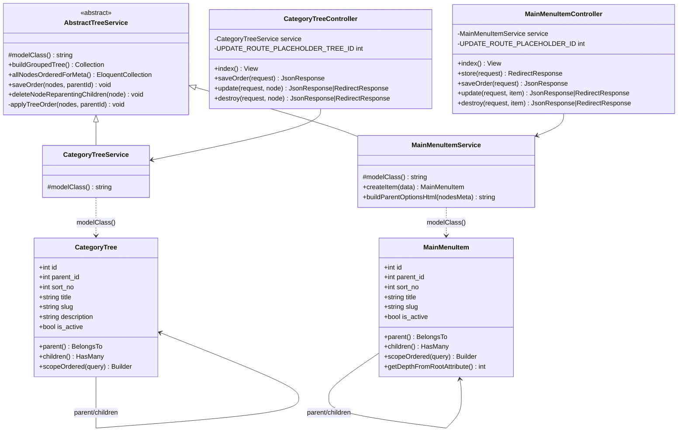
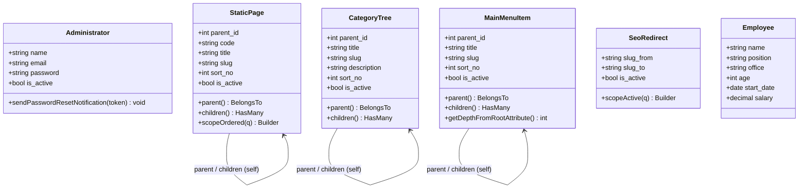
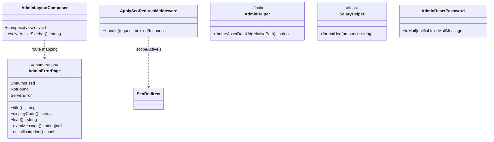

# Architecture

Laravel 10, PHP 8.2. Admin-only SPA-free приложение: Blade-first рендеринг, Bootstrap 5 (SB Admin тема), jQuery + bootstrap-table для серверных таблиц, SortableJS для drag-and-drop деревьев. Vue используется точечно только для Tree-модулей.

---

## 1. Слои и поток запроса

```
HTTP Request
    → Middleware (auth:admin, ApplySeoRedirectMiddleware, …)
    → Route (admin-web.php / admin-api.php)
    → FormRequest (валидация + normalize)
    → Controller (тонкий оркестратор)
    → Service (бизнес-логика, трансформации)
    → Model (Eloquent: relations, scopes, casts)
    → Resource (JSON для API-эндпоинтов)
    → Blade View / JsonResponse
```

---

## 2. Карта модулей

```mermaid
graph TD
    subgraph Admin Web Controllers
        DC[DashboardController]
        AC[AdministratorController]
        SPC[StaticPageController]
        SRC[SeoRedirectController]
        CTC[CategoryTreeController]
        MMIC[MainMenuItemController]
    end

    subgraph Admin API Controllers  
        ATDC[AdministratorTableDataController]
        ETDC[EmployeeTableDataController]
        SPTDC[StaticPageTableDataController]
        SRTDC[SeoRedirectTableDataController]
    end

    subgraph Services
        DBS[AdminDashboardService]
        ALS[AdministratorListingService]
        ELS[EmployeeListingService]
        SPLS[StaticPageListingService]
        SRLS[SeoRedirectListingService]
        ATS[AbstractTreeService]
        CTS[CategoryTreeService]
        MMIS[MainMenuItemService]
    end

    subgraph Models
        ADM[Administrator]
        EMP[Employee]
        SP[StaticPage]
        SR[SeoRedirect]
        CT[CategoryTree]
        MMI[MainMenuItem]
    end

    subgraph Resources
        AR[AdministratorResource]
        ER[EmployeeResource]
        SPR[StaticPageResource]
        SRR[SeoRedirectResource]
    end

    subgraph Helpers
        BTH[BootstrapTableHelper]
        AH[AdminHelper]
        SH[SalaryHelper]
    end

    DC --> DBS
    AC --> ADM
    SPC --> SP
    SRC --> SR
    CTC --> CTS
    MMIC --> MMIS

    ATDC --> ALS --> AR
    ETDC --> ELS --> ER
    SPTDC --> SPLS --> SPR
    SRTDC --> SRLS --> SRR

    ALS --> BTH
    ELS --> BTH
    SPLS --> BTH
    SRLS --> BTH

    CTS --> ATS --> CT
    MMIS --> ATS --> MMI

    DBS --> EMP
```



---

## 3. Tree-модуль — диаграмма классов



---

## 4. Table-модуль — диаграмма классов

```mermaid
classDiagram
    class BootstrapTableHelper {
        <<final>>
        +parsePaginationParams(request) array
        +stringCastType(query) string
    }

    class AdministratorListingService {
        -SORTABLE list
        +paginateForBootstrapTable(request) array
        -applySearch(query, search) void
    }

    class EmployeeListingService {
        -SORTABLE list
        +orderedForDataTable() Collection
        +paginateForBootstrapTable(request) array
        -applySearch(query, search) void
    }

    class StaticPageListingService {
        -SORTABLE list
        +paginateForBootstrapTable(request) array
        -applySearch(query, search) void
    }

    class SeoRedirectListingService {
        -SORTABLE list
        +paginateForBootstrapTable(request) array
        -applySearch(query, search) void
    }

    class AdministratorTableDataController {
        +__invoke(request) JsonResponse
    }

    class EmployeeTableDataController {
        +__invoke(request) JsonResponse
    }

    class StaticPageTableDataController {
        +__invoke(request) JsonResponse
    }

    class SeoRedirectTableDataController {
        +__invoke(request) JsonResponse
    }

    class AdministratorResource {
        +toArray(request) array
    }

    class EmployeeResource {
        +toArray(request) array
    }

    class StaticPageResource {
        +toArray(request) array
    }

    class SeoRedirectResource {
        +toArray(request) array
    }

    AdministratorListingService ..> BootstrapTableHelper
    EmployeeListingService ..> BootstrapTableHelper
    StaticPageListingService ..> BootstrapTableHelper
    SeoRedirectListingService ..> BootstrapTableHelper

    AdministratorTableDataController --> AdministratorListingService
    AdministratorTableDataController --> AdministratorResource

    EmployeeTableDataController --> EmployeeListingService
    EmployeeTableDataController --> EmployeeResource

    StaticPageTableDataController --> StaticPageListingService
    StaticPageTableDataController --> StaticPageResource

    SeoRedirectTableDataController --> SeoRedirectListingService
    SeoRedirectTableDataController --> SeoRedirectResource
```



---

## 5. Модели — связи



---

## 6. Вспомогательные классы и инфраструктура



---

## 7. Архитектурные паттерны

### Table CRUD (плоский список)
```
Web Controller  →  Blade View (передаёт tableId + dataUrl)
                        ↕ (AJAX)
API Controller  →  ListingService.paginateForBootstrapTable()
                        └→ BootstrapTableHelper (params + cast)
                   Resource.toArray()  →  JSON {total, rows}
```

### Tree CRUD (иерархия с drag-and-drop)
```
Web Controller  →  Service.buildGroupedTree()   →  Blade (рекурсивный рендер)
                   Service.allNodesOrderedForMeta() → JS meta + editor map
                   Service.saveOrder()          ←  AJAX DnD payload
                   Service.deleteNodeReparentingChildren() ← AJAX delete
                   Service.createItem()         ←  HTML form (только MainMenu)
```

### Listing Service контракт
Каждый `*ListingService` реализует метод:
```
paginateForBootstrapTable(Request): array{total: int, rows: Collection}
```
Параметры (`limit`, `offset`, `search`, `sort`, `order`) парсятся через `BootstrapTableHelper::parsePaginationParams()`. Поиск ограничен `SORTABLE` константой белого списка.
